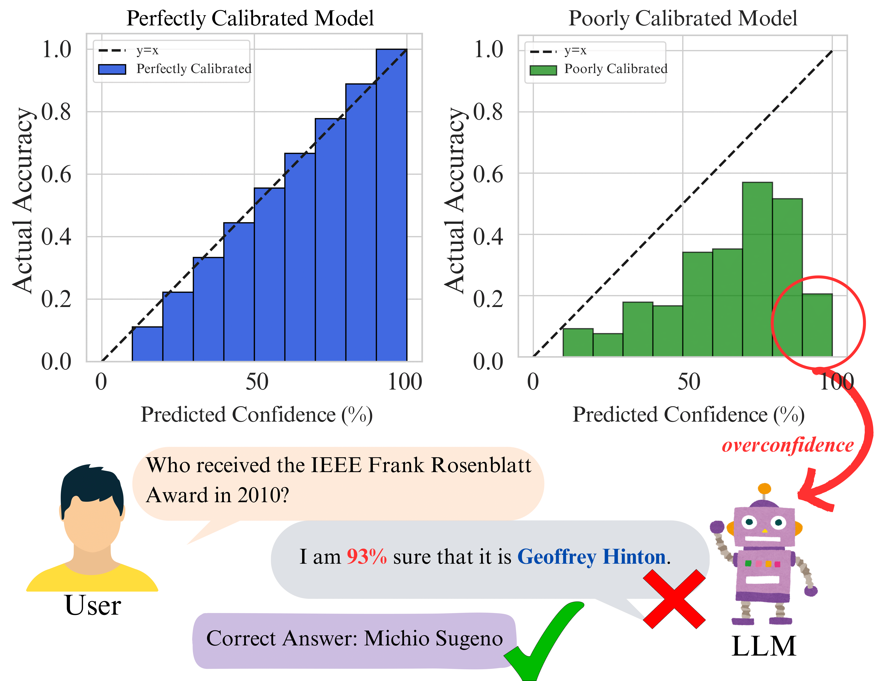

# Mind the Confidence Gap: Overconfidence, Calibration, and Distractor Effects in Large Language Models

[](https://arxiv.org/abs/2502.11028)


## Background 🧠

Large Language Models (LLMs) excel at numerous tasks but often struggle with **confidence calibration** — the alignment between their predicted confidence and actual accuracy. Models can be overconfident in incorrect answers or underconfident in correct ones, which poses significant challenges for critical applications.

### Calibration in LLMs

Calibration errors occur when a model's predicted confidence diverges from its actual accuracy, potentially misleading users. For instance, a model might assert 80% confidence in a fact but be incorrect. By measuring the **Expected Calibration Error (ECE)**, this project quantifies the discrepancy between a model's predicted confidence and its actual correctness.

<div align="center">
  
  <p>Example of overconfidence in LLMs. The model predicts "<i>Geoffrey Hinton</i>" with 93% confidence for the wrong answer to a factual question.</p>
</div>

## Supported Models

- **OpenAI Models:**
  - `gpt-4-turbo`
  - `gpt-4o-mini`
  - `gpt-4o`
  
- **Groq Models:**
  - `llama-3.1-8b-instant`
  - `llama3-8b-8192`
  - `gemma2-9b-it`

*Note: The supported models list can be extended with slight modifications in the code.*

## Installation 🛠️

Follow these steps to set up the project:

1. **Clone the Repository:**
    ```bash
    git clone https://github.com/prateekchhikara/llms-calibration
    cd llms-calibration
    ```

2. **Create and Activate a Virtual Environment (Optional but Recommended):**
    ```bash
    python -m venv venv
    source venv/bin/activate  # On Windows: venv\Scripts\activate
    ```

3. **Install Dependencies:**
    ```bash
    pip install -r requirements.txt
    ```

4. **Set Up Environment Variables:**
    ```bash
    cp .env.example .env
    # Edit .env with your API keys
    ```

## Usage 🚀

### Basic Evaluation

Run an evaluation for a specific model using the following command:

```bash
python main.py \
    --model_name "gpt-4o-mini" \
    --start_index 0 \
    --end_index 20 \
    --results_dir "results/" \
    --approach "normal"
```

### Batch Processing

For processing multiple batches, utilize the provided shell script:

1. **Make the Script Executable:**
    ```bash
    chmod +x run.sh
    ```

2. **Execute the Script:**
    ```bash
    ./run.sh
    ```

## Project Structure 📁

```
├── main.py                 # Main evaluation script
├── llms.py                 # LLM client implementations
├── utils.py                # Utility functions
├── prompts.py              # Evaluation prompts
├── run.sh                  # Batch processing script
├── generate_figures.ipynb  # Visualization notebook
└── README.md               # Project documentation
```

## License 📄

This project is licensed under the [MIT License](LICENSE).

## Contact 📧

For questions and feedback, please contact me directly at <a href="mailto:prateekchhikara24@gmail.com">prateekchhikara24@gmail.com</a>.
